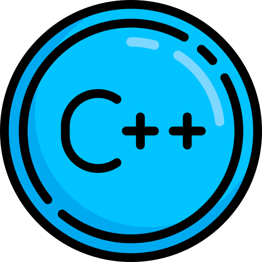

# SOFTWARE ENGINEER

## TECHNICAL SKILLS

          

 

## EDUCATION
-  **Master of Science, Application Development - Information Technology** 
    Nova Southeastern University Davie, FL  

    _Core Courses: Mobile Application Development in iOS (Swift) and Android, Software Development (Java, Python & C++), Database & System Integration and Administration, Platform       and Network Technologies, Security Technologies_  

-  **Bachelor of Science, Computer Science**  
  Nova Southeastern University Davie, FL

 

## PROJECTS

<table> <tr>
    <!-- <!-- <th>Table header column 1</th> -->
    <!-- <th>Table header column 2</th> -->
</tr>
<tr>
    <td> 
        <strong>Title </strong>: GitCHEAT  
        <strong>Description</strong>: GitCheat provides a quick reference to commonly used Git commands that are used for source control.   
        <strong>Language</strong>: Java, Google Firebase(Backend service)
    </td>
    <td>
        

            
        

    </td>
</tr>
<tr>
    <td> 
        <strong>Title </strong>: DotDrop  
        <strong>Description</strong>: An iOS DotDrop Game. A game where the player must try to spin the color wheel to match with the color of the dot that's dropping to gain points.   
        <strong>Language</strong>: Swift, XCode
    </td>
    <td>
        

            
        

    </td>
</tr>
<tr>
    <td> 
        <strong>Title </strong>: KidCal  
        <strong>Description</strong>: This is a simple calculator with basic operations such as addition, subtraction and it includes a colorful number pad from 1 to 9. All the numeric and operation buttons are audio embedded with a childish robotic voice.    
        <strong>Language</strong>: Java, MySQL(Backend Database)
    </td>
    <td>
        

            
        

    </td>
</tr>
</table>

